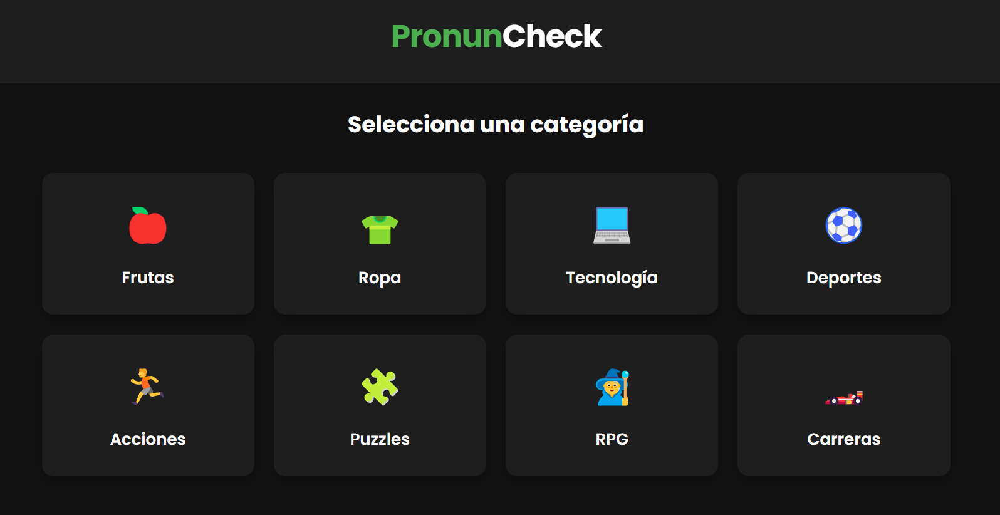
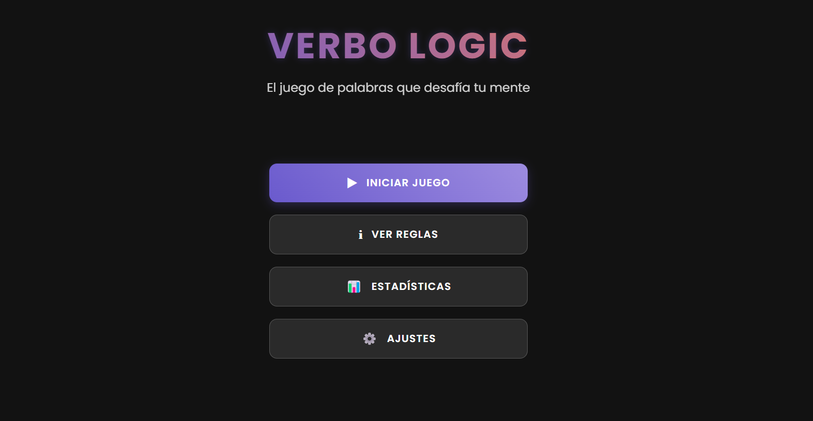

# Mi Portafolio Web 🖥️

Bienvenido a mi portafolio web, un sitio diseñado para mostrar mis proyectos, habilidades y experiencia en desarrollo web.

🔗 **Demo en vivo:** [jgcamiloaga.me](https://jgcamiloaga.me)

---

## 📋 Descripción

Este repositorio contiene el código fuente de mi portafolio personal. Aquí podrás encontrar una selección de mis proyectos más destacados, información sobre mis habilidades técnicas y una breve presentación profesional.

## 🖼️ Capturas de pantalla

### Versión Escritorio

<!-- Agrega aquí una imagen de la versión escritorio de tu portafolio -->
<!--  -->

### Versión Móvil

<!-- Agrega aquí una imagen de la versión móvil de tu portafolio -->
<!--  -->

## ✨ Características

- Diseño responsivo y adaptable a cualquier dispositivo
- Interfaz moderna y minimalista
- Accesibilidad siguiendo buenas prácticas (WCAG)
- Optimización de rendimiento y carga rápida
- Visualización de habilidades con iconos personalizados
- Sección de proyectos con imágenes y descripciones
- Enlaces a redes sociales y contacto

## 📁 Estructura del proyecto

```
├── index.html
├── css/
│   ├── style.css
│   └── mobile-project-cards.css
├── js/
│   ├── script.js
│   └── mobile-project-cards.js
├── img/
│   ├── foto.png
│   ├── icon.ico
│   ├── social-share.png
│   ├── projects/
│   └── skills/
├── README.md
├── LICENSE
└── CNAME
```

## 🛠️ Tecnologías utilizadas

- **HTML5**: Para la estructura semántica y accesible del sitio web.
- **CSS3**: Para los estilos modernos, responsivos y animaciones.
- **JavaScript**: Para la funcionalidad, interactividad y manejo dinámico de los componentes.
- **Figma**: Para el diseño UI/UX y prototipado previo al desarrollo.

> ⚡ **Próximamente:** Este portafolio será migrado a **Astro** para aprovechar su rendimiento, flexibilidad y capacidades modernas de desarrollo web. ¡Mantente atento a futuras actualizaciones!

## 🚀 Instalación y uso

1. Clona este repositorio:
   ```bash
   git clone https://github.com/jgcamiloaga/Portafolio.git
   ```
2. Abre el archivo `index.html` en tu navegador preferido.
3. Personaliza el contenido según tus necesidades (opcional).

No se requieren dependencias ni instalación adicional.

## 📬 Contacto

¿Te gustaría contactarme? Puedes encontrarme en:

- [LinkedIn](https://www.linkedin.com/in/jgcamiloaga)
- [Twitter](https://twitter.com/jgcamiloaga)
- Email: jgcamiloaga@gmail.com

## 📄 Licencia

Este proyecto está bajo la licencia MIT. Consulta el archivo LICENSE para más información.
